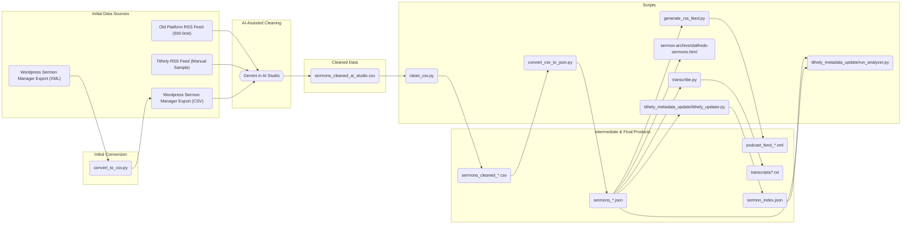

# St Alfred's Sermons Data Processing

## Project Goal

This project documents the process of migrating the sermon archive for St Alfred's Anglican Church from a WordPress instance (using the Sermon Manager for WP-Church plugin) to the Tithely platform.

The work here has two primary objectives:

1.  **Data Migration:** To clean, process, import, and correct the data exported from WordPress feed into the Tithely platform.
2.  **Contingency Planning:** To demonstrate the feasibility of hosting the entire sermon back-catalogue as a static, searchable website, now located in the `sermon-archive/` directory. This serves as a fallback option and to ensure we retain access to the archive as Tithely lacks export capability.

## Overview

This project contains a set of scripts and a single-page web application to process, clean, and display sermon data for St Alfred's Anglican Church.

The main goal is to take a raw CSV export of sermon data, clean it, enrich it, and then present it as:
1.  A filterable, searchable sermon browser (`sermon-archive/stalfreds-sermons.html`).
2.  A podcast-compliant RSS feed (`podcast_feed.xml`).
3.  Imported sermon archive in Tithely (via `tithely_metadata_update`).

We may also be able to add transcripts with Whisper, and use that to create an enhanced topic index.

## Data Pipeline

The following diagram illustrates the flow of data from the initial sources to the final products.



A note on the initial data cleaning: The initial export from WordPress was manually cleaned and then processed using Gemini in AI Studio to perform a broad data cleaning and structuring, resulting in the `sermons_cleaned_ai_studio.csv` file, which serves as the primary source for the rest of the pipeline.

## Scripts and Usage

This project is designed to be run as a pipeline. The `run_processing_pipeline.sh` script automates the main data conversion steps.

### Main Pipeline

**`run_processing_pipeline.sh`**

This is the main script to run the entire data pipeline. It cleans the source CSV, converts it to JSON, and generates the RSS feed, creating timestamped output files.

**Usage:**
```bash
./run_processing_pipeline.sh
```

### Individual Scripts

**1. `clean_csv.py`**

*   **Purpose:** Reads a CSV file from standard input, identifies service time from audio filename, adds melbourne date/time, makes titles unique, and removes redundant text from the `content_text` column.
*   **Usage:**
    ```bash
    python3 clean_csv.py input.csv output.csv
    ```

**2. `convert_csv_to_json.py`**

*   **Purpose:** Converts a cleaned CSV file into a JSON file suitable for the sermon browser and other scripts.
*   **Usage:**
    ```bash
    python3 convert_csv_to_json.py <input_csv_path> <output_json_path>
    ```

**3. `generate_rss_feed.py`**

*   **Purpose:** Generates a podcast-compliant RSS feed (XML) from a JSON file.
*   **Usage:**
    ```bash
    python3 generate_rss_feed.py <input_json_path> <output_rss_path>
    ```

### Transcription

**`transcribe.py`**

*   **Purpose:** Transcribes audio files listed in a sermons JSON file using OpenAI's Whisper. It can process the entire set, or a random sample for evaluation.
*   **Dependencies:** Requires `faster-whisper`.
    ```bash
    mise install && uv sync

*   **Note on Performance:** For CPU-only transcription, `faster-whisper` will automatically utilize available CPU cores. For GPU acceleration, ensure CUDA is properly configured and `faster-whisper` is installed with GPU support (e.g., `pip install faster-whisper[cuda-cu118]`).
    ```
*   **Usage:**
    ```bash
    # Transcribe all sermons
    python3 transcribe.py sermons.json

    # Transcribe a random sample of 5 sermons
    python3 transcribe.py sermons.json --sample-size 5

    # Transcribe a specific sermon by its exact title
    python3 transcribe.py sermons.json --title "Council vs. King"
    ```

### Sermon Browser

**`sermon-archive/stalfreds-sermons.html`**

This is a self-contained HTML file that provides a rich, interactive interface for browsing the sermon archive. It loads its data from `sermons.json` and includes features like:

*   Multi-select filtering for series, preacher, year, and topic.
*   Free-text search across all sermon data.
*   Pagination.
*   Clickable links to Bible passages on ref.ly.
*   A responsive layout that adapts to mobile and desktop screens.

## Metadata Updates

After the initial data migration, it may be necessary to perform bulk updates to the sermon metadata directly within Tithely. The `tithely_metadata_update/` directory contains tools to automate this process.

### The Challenge

Tithely's web interface does not provide a way to bulk-edit sermon metadata, such as assigning sermons to a series or a podcast. Updating hundreds of sermons manually is time-consuming and error-prone.

### The Solution

The `tithely_updater.py` script uses browser automation (via Playwright) to log in to the Tithely admin interface and systematically update each sermon based on the data in `sermons.json`.

The script performs the following steps:
1.  Loads sermon data from `sermons.json`.
2.  Creates an index of all sermons available in the Tithely admin panel by scraping the sermon list pages.
3.  For each sermon in the local `sermons.json`, it finds the corresponding sermon in the Tithely index.
4.  It then navigates to the edit page for that sermon and updates the following fields:
    *   Speaker
    *   Sermon Series
    *   Podcast ID
    *   Bible Passage

### Setup and Usage

1.  **Install Dependencies:**
    ```bash
    mise install && uv sync
    ```

2.  **Configure Credentials:**
    Create a `.env` file in the project root:
    ```
    TITHELY_EMAIL=your_email@example.com
    TITHELY_PASSWORD=your_password
    ```
    This file is gitignored, so your credentials will not be committed.

3.  **Run the Updater:**
    To create a new index of the sermons on Tithely:
    ```bash
    python tithely_metadata_update/tithely_updater.py --index-only
    ```
    To run the full update process:
    ```bash
    python tithely_metadata_update/tithely_updater.py
    ```
    The script will open a browser window and perform the updates. You can monitor its progress in the terminal.

4.  **Analyze Discrepancies:**
    The `analyze_updates.py` script can be used to compare the local `sermons.json` with the `sermon_index.json` from Tithely and identify any gaps or discrepancies.
    ```bash
    python tithely_metadata_update/run_analyzer.py
    ```

5.  **Add File Sizes:**
    The `add_file_sizes.py` script can be used to add the `file_size_bytes` field to `sermons.json`, which is used for matching sermons with duplicate titles.
    ```bash
    python tithely_metadata_update/add_file_sizes.py
    ```
