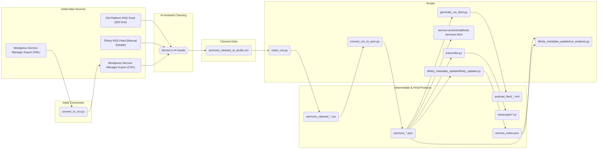

# St Alfred's Sermons Data Processing

## Project Goal

This project documents the process of migrating the sermon archive for St Alfred's Anglican Church from a WordPress instance (using the Sermon Manager for WP-Church plugin) to the Tithely platform.

The work here has two primary objectives:

1.  **Data Migration:** To clean, process, import, and correct the data exported from WordPress feed into the Tithely platform.
2.  **Contingency Planning:** To demonstrate the feasibility of hosting the entire sermon back-catalogue as a static, searchable website, now located in the `sermon-archive/` directory. This serves as a fallback option and to ensure we retain access to the archive as Tithely lacks export capability.

## Overview

This project contains a set of scripts and a single-page web application to process, clean, and display sermon data for St Alfred's Anglican Church.

The main goal is to take a raw CSV export of sermon data, clean it, enrich it, and then present it as:
1.  A filterable, searchable sermon browser (`sermon-archive/stalfreds-sermons.html`).
2.  A podcast-compliant RSS feed (`podcast_feed.xml`).
3.  Imported sermon archive in Tithely (via `tithely_metadata_update`).

We may also be able to add transcripts with Whisper, and use that to create an enhanced topic index.

## Data Pipeline

The following diagram illustrates the flow of data from the initial sources to the final products.



A note on the initial data cleaning: The initial export from WordPress was manually cleaned and then processed using Gemini in AI Studio to perform a broad data cleaning and structuring, resulting in the `sermons_cleaned_ai_studio.csv` file, which serves as the primary source for the rest of the pipeline.

## Scripts and Usage

This project is designed to be run as a pipeline. The `run_processing_pipeline.sh` script automates the main data conversion steps.

### Main Pipeline

**`run_processing_pipeline.sh`**

This is the main script to run the entire data pipeline. It cleans the source CSV, converts it to JSON, and generates the RSS feed, creating timestamped output files.

**Usage:**
```bash
./run_processing_pipeline.sh
```

### Individual Scripts

**1. `clean_csv.py`**

*   **Purpose:** Reads a CSV file from standard input, identifies service time from audio filename, adds melbourne date/time, makes titles unique, and removes redundant text from the `content_text` column.
*   **Usage:**
    ```bash
    python3 clean_csv.py input.csv output.csv
    ```

**2. `convert_csv_to_json.py`**

*   **Purpose:** Converts a cleaned CSV file into a JSON file suitable for the sermon browser and other scripts.
*   **Usage:**
    ```bash
    python3 convert_csv_to_json.py <input_csv_path> <output_json_path>
    ```

**3. `generate_rss_feed.py`**

*   **Purpose:** Generates a podcast-compliant RSS feed (XML) from a JSON file.
*   **Usage:**
    ```bash
    python3 generate_rss_feed.py <input_json_path> <output_rss_path>
    ```

### Transcription

**`transcribe.py`**

*   **Purpose:** Transcribes audio files listed in a sermons JSON file using OpenAI's Whisper. It can process the entire set, or a random sample for evaluation.
*   **Dependencies:** Requires `faster-whisper`.
    ```bash
    mise install && uv sync

*   **Note on Performance:** For CPU-only transcription, `faster-whisper` will automatically utilize available CPU cores. For GPU acceleration, ensure CUDA is properly configured and `faster-whisper` is installed with GPU support (e.g., `pip install faster-whisper[cuda-cu118]`).
    ```
*   **Usage:**
    ```bash
    # Transcribe all sermons
    python3 transcribe.py sermons.json

    # Transcribe a random sample of 5 sermons
    python3 transcribe.py sermons.json --sample-size 5

    # Transcribe a specific sermon by its exact title
    python3 transcribe.py sermons.json --title "Council vs. King"
    ```

### Sermon Browser

**`sermon-archive/stalfreds-sermons.html`**

This is a self-contained HTML file that provides a rich, interactive interface for browsing the sermon archive. It loads its data from `sermons.json` and includes features like:

*   Multi-select filtering for series, preacher, year, and topic.
*   Free-text search across all sermon data.
*   Pagination.
*   Clickable links to Bible passages on ref.ly.
*   A responsive layout that adapts to mobile and desktop screens.

## Metadata Updates

After the initial data migration, it may be necessary to perform bulk updates or analysis of the sermon metadata directly within Tithely. The `tithely_metadata_update/` directory contains tools to automate this process.

### The Challenge

Tithely's web interface does not provide a way to bulk-edit sermon metadata, such as assigning sermons to a series or a podcast. Furthermore, the data present on the Tithely site may be incomplete or inconsistent compared to local records. Updating and verifying hundreds of sermons manually is time-consuming and error-prone.

### The Solution: A Data-First Approach

The scripts in this directory allow for a data-driven workflow: first, we scrape all available data from the Tithely website into a local JSON file (`sermon_index.json`). Then, we can analyze this data, compare it against our local CSV records, and finally use the enriched data to update Tithely.

This workflow is primarily managed by the following scripts:

#### 1. `selective_importer.py` - Scraper and Indexer

This is the main script for scraping sermon data from the Tithely website. It logs in, navigates the sermon list pages, and creates a local JSON file (`sermon_index_YYYY-MM-DD.json`) containing the data. It can optionally enrich this data by visiting each sermon's detail page.

**Usage:**
-   **Create a basic index:**
    ```bash
    ./tithely_metadata_update/selective_importer.py --create-index
    ```
-   **Create an enriched index (with description, passage, audio URL):**
    ```bash
    ./tithely_metadata_update/selective_importer.py --create-index --enrich
    ```
-   **Create a full index (with details and file sizes):**
    ```bash
    ./tithely_metadata_update/selective_importer.py --create-index --enrich --with-file-sizes
    ```
-   **Limit the number of sermons for testing:**
    ```bash
    ./tithely_metadata_update/selective_importer.py --create-index --enrich --limit 10
    ```

#### 2. `get_csv_file_sizes.py` - Enriching Local Data

To facilitate accurate matching between the local CSV and the scraped Tithely data, it's useful to have the audio file sizes for the local records. This script generates that information.

**Usage:**
-   It reads `sermons.csv` and generates a new file, `csv_audio_sizes.csv`, containing the `post_id`, `audio_url`, and `audio_file_size`.
    ```bash
    ./get_csv_file_sizes.py
    ```

#### 3. `compare_data.py` - Gap Analysis

This script provides a detailed comparison between the local `sermons.csv` file and a scraped `sermon_index.json` file. It helps identify which sermons are missing from each source and highlights discrepancies in metadata for sermons that exist in both.

**Usage:**
-   The script automatically looks for `sermons.csv` and the latest `sermon_index_*.json` file.
    ```bash
    ./compare_data.py
    ```

#### 4. `tithely_updater.py` - The Updater (Future Work)

The original `tithely_updater.py` script can be adapted to use the clean, enriched data from the `sermon_index.json` to perform bulk updates on the Tithely website. This has not yet been the focus of our work.

