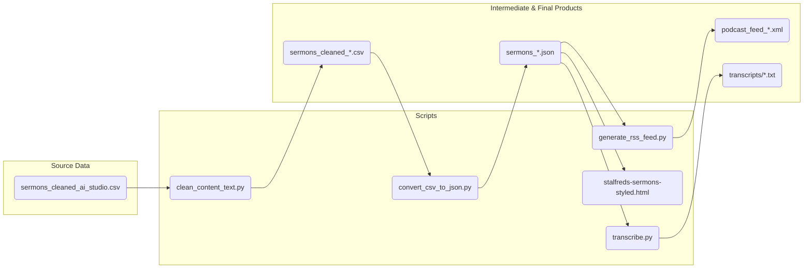

# St Alfred's Sermons Data Processing

## Project Goal

This project documents the process of migrating the sermon archive for St Alfred's Anglican Church from a WordPress instance (using the Sermon Manager for WP-Church plugin) to the Tithely platform.

The work here has two primary objectives:

1.  **Data Migration:** To clean, process, and re-format the data exported from WordPress into an RSS feed (`podcast_feed.xml`) that is suitable for a clean import into Tithely.
2.  **Contingency Planning:** To demonstrate the feasibility of hosting the entire sermon back-catalogue as a static, searchable website (`stalfreds-sermons-styled.html`). This serves as a fallback option in case the Tithely import is unsuccessful or does not meet the church's needs, ensuring the historical archive remains accessible.

## Overview

This project contains a set of scripts and a single-page web application to process, clean, and display sermon data for St Alfred's Anglican Church.

The main goal is to take a raw CSV export of sermon data, clean it, enrich it, and then present it in two main ways:
1.  A filterable, searchable sermon browser (`stalfreds-sermons-styled.html`).
2.  A podcast-compliant RSS feed (`podcast_feed.xml`).

Additionally, there are scripts to generate audio transcriptions using OpenAI's Whisper.

## Data Pipeline

The following diagram illustrates the flow of data from the initial CSV to the final products.



## Scripts and Usage

This project is designed to be run as a pipeline. The `run_processing_pipeline.sh` script automates the main data conversion steps.

### Main Pipeline

**`run_processing_pipeline.sh`**

This is the main script to run the entire data pipeline. It cleans the source CSV, converts it to JSON, and generates the RSS feed, creating timestamped output files.

**Usage:**
```bash
./run_processing_pipeline.sh
```

### Individual Scripts

**1. `clean_content_text.py`**

*   **Purpose:** Reads a CSV file from standard input and removes redundant text (e.g., "Preacher:", "Series:") from the `content_text` column.
*   **Usage:**
    ```bash
    cat input.csv | python3 clean_content_text.py > output.csv
    ```

**2. `convert_csv_to_json.py`**

*   **Purpose:** Converts a cleaned CSV file into a JSON file suitable for the sermon browser and other scripts.
*   **Usage:**
    ```bash
    python3 convert_csv_to_json.py <input_csv_path> <output_json_path>
    ```

**3. `generate_rss_feed.py`**

*   **Purpose:** Generates a podcast-compliant RSS feed (XML) from a JSON file.
*   **Usage:**
    ```bash
    python3 generate_rss_feed.py <input_json_path> <output_rss_path>
    ```

### Transcription

**`transcribe.py`**

*   **Purpose:** Transcribes audio files listed in a sermons JSON file using OpenAI's Whisper. It can process the entire set, or a random sample for evaluation.
*   **Dependencies:** Requires `openai-whisper` and `ffmpeg`.
    ```bash
    # 1. Install ffmpeg (for Debian/Ubuntu)
    sudo apt update && sudo apt install ffmpeg

    # 2. Install whisper
    pip install -U openai-whisper
    ```
*   **Usage:**
    ```bash
    # Transcribe all sermons
    python3 transcribe.py sermons.json

    # Transcribe a random sample of 5 sermons
    python3 transcribe.py sermons.json --sample-size 5

    # Transcribe a specific sermon by its exact title
    python3 transcribe.py sermons.json --title "Council vs. King"
    ```

### Sermon Browser

**`stalfreds-sermons-styled.html`**

This is a self-contained HTML file that provides a rich, interactive interface for browsing the sermon archive. It loads its data from `sermons.json` and includes features like:

*   Multi-select filtering for series, preacher, year, and topic.
*   Free-text search across all sermon data.
*   Pagination.
*   Clickable links to Bible passages on ref.ly.
*   A responsive layout that adapts to mobile and desktop screens.
